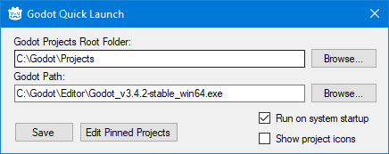

# GodotQuickLaunch
An application that lets you launch Godot projects from the system tray.

By default it will try to open the project.godot file with the default program associated with it.

You can also select a specific Godot executable to use instead.

Here is an example of the tray menu

And here is the settings

